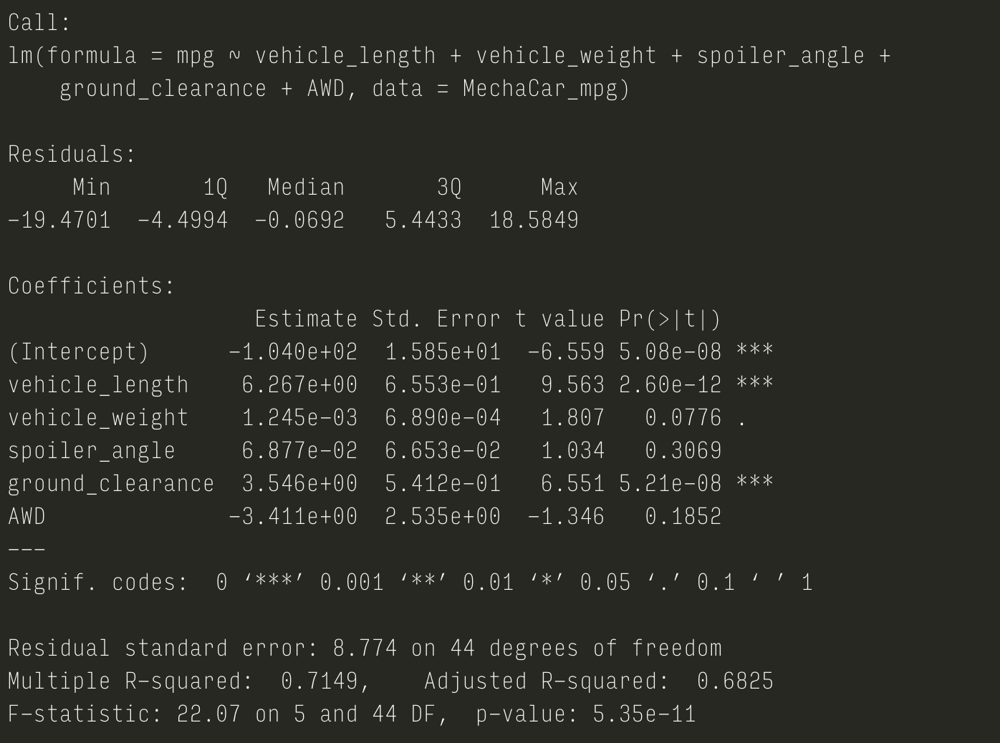
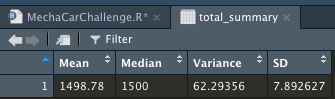
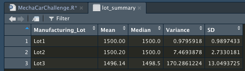
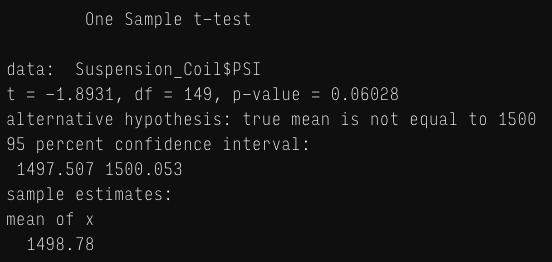
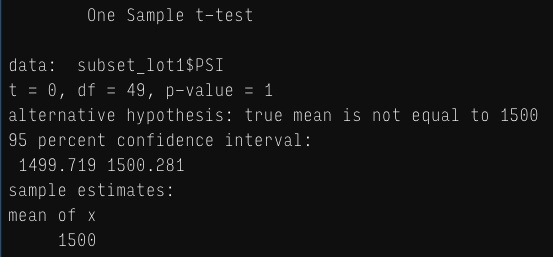
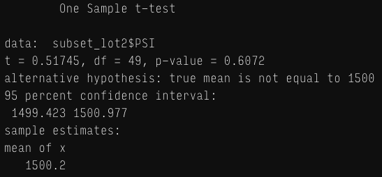
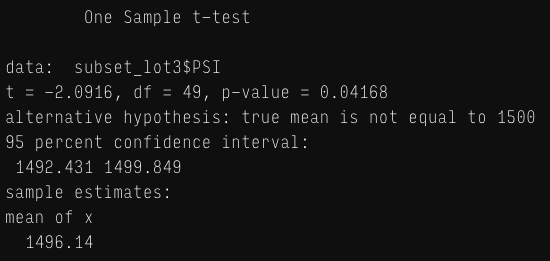

# 15-MechaCar_Statistical_Analysis-lukeperrin

## Linear Regression to Predict MPG

Data source:  [MechaCar_mpg.csv](data/MechaCar_mpg.csv) 

R Script:  [MechaCarChallenge.R](MechaCarChallenge.R) (Deliverable 1)

####  Linear Regression Results:

#### Linear Regression Analysis:

1. **Which variables/coefficients provided a non-random amount of variance to the mpg values in the dataset?**

   > *The amount of non-random variance (i.e. high correlation) can be determined from the `Estimate Coefficient` of each variable. With this in mind, it is evident that both the `vehicle_length` and `ground_clearance` present high degrees of correlation with the `mpg`. This is indicated by their large and positive `Estimate Coefficient`s.*

2. **Is the slope of the linear model considered to be zero? Why or why not?**

   > *Given that the `p-value = 5.35e-11 << 0.05`, the model suggests that the null hypothesis should be rejected. Therefore, the slope of the linear model should **NOT** be considered zero.*

3. **Does this linear model predict mpg of MechaCar prototypes effectively? Why or why not?**

   > *This model is somewhat effective at predicting `mpg` outcomes given these variables. Considering the `Multiple R-squared: 0.7149` value,  it is estimated that the model will accurately predict ~71.49% of the `mpg` outcomes.*/>

## Summary Statistics on Suspension Coils

Data source:  [Suspension_Coil.csv](data/Suspension_Coil.csv) 

R Script:  [MechaCarChallenge.R](MechaCarChallenge.R) (Deliverable 2)

####  Total Summary Statistics Results (`total_summary` table):

#### Lot Summary Statistics Results (`lot_summary` table):

#### Summary Statistics Analysis:

**The design specifications for the MechaCar suspension coils dictate that the variance of the suspension coils must not exceed 100 pounds per square inch. Does the current manufacturing data meet this design specification for all manufacturing lots in total and each lot individually? Why or why not?**

> Based on the `total_summary` table statistics, it would seem that the variance complies with this requirement (i.e. the variance of the suspension coils is `62.29356 < 100`). However, upon closer inspection of each lot in `lot_summary` table statistics, it is clear that really only `Lot1` and `Lot2` meet this design requirement. `Lot3` is throwing the total statistical interpretation off by its variance value of `170.2861224`  (which is `>> 100`).

##  T-Tests on Suspension Coils

Data source:  [Suspension_Coil.csv](data/Suspension_Coil.csv) 

R Script:  [MechaCarChallenge.R](MechaCarChallenge.R) (Deliverable 3)

#### T-Test Results:

All Lots:

`Lot1`:

`Lot2`:

`Lot3`:

**Results Summary:**

| Lot(s)  | Mean of x   | p-value     | T-test  |
| ------- | ----------- | ----------- | ------- |
| `Lot1`  | 1500        | 1           | 0       |
| `Lot2`  | 1500.2      | 0.6072      | 0.51745 |
| `Lot3`  | 1496.14     | 0.04168     | -2.0916 |
| **All** | **1498.78** | **0.06028** | **-1.8931** |

#### Summary Statistics Analysis:

- *`Lot1` presents a highly reliable statistical match to the presumed mean PSI values across the population. The t-test value of `0` suggests that there is no statistically significant difference between the mean PSI of the sample (i.e. `Lot1`) distribution and the population distribution. A `p-value` of `1` indicated that the null hypothesis should be accepted (because it is `>> 0.05`).*
- *`Lot2` also (but not as drastically) presents a reliable statistical match to the presumed mean PSI values across the population. The t-test value of `0.51745` suggests that there is little statistical difference between the mean PSI of the sample (i.e. `Lot2`) distribution and the population distribution. A `p-value` of `0.6072` indicated that the null hypothesis should be accepted (because it is `> 0.05`).*
- *`Lot3` presents a lowly reliable statistical match to the presumed PSI values across the population. The t-test value of `-2.0916` suggests that there is a significant statistical difference between the mean PSI of the sample (i.e. `Lot3`) distribution and the population distribution. A `p-value` of `0.04168` indicated that the null hypothesis should be rejected (because it is `< 0.05`).*
- *Looking at the T-test results across all lots, there can be observed a moderately reliable statistical match to the presumed PSI values across the population. The t-test value of `-1.8931` suggests that there is quite a significant statistical difference between the mean PSI of the sample distribution and the population distribution. This is evidently being heavily distorted by the `Lot3` mean. Still, the `p-value` of `0.06028` indicated that the null hypothesis should be accepted (because it is `> 0.05`).*

## Study Design: MechaCar vs Competition

(Deliverable 4)

**Write a short description of a statistical study that can quantify how the MechaCar performs against the competition. In your study design, think critically about what metrics would be of interest to a consumer: for a few examples, cost, city or highway fuel efficiency, horse power, maintenance cost, or safety rating.**

- What metric or metrics are you going to test?

  > *The following metrics could be supplemented to provide further investigation of MechaCar’s standing on the automotive market:*
  >
  > 1. Manufacturer
  >
  > 2. Engine/Transmission Type: e.g. gas/automatic, gas/manual, hybrid, or electric.
  >
  > 3. USD-per-Mile: to assess cost efficiency across both electric and gas vehicles.
  >
  >    (Alternatively, could incorporate `kWh/mile` as an electric vehicle metric against `mgp`.)
  >
  > 4. Annual repair/maintance costs
  >
  > 5. Market price
  >
  > 6. Mileage reached at end-of-life

- What is the null hypothesis or alternative hypothesis?

  > <u>Null hypothesis:</u>
  >
  > *MechaCar is a worthwhile investment due to the savings MechaCar owners achieve over the car’s life compared to other vehicles on the market.*

- What statistical test would you use to test the hypothesis? And why?

  > *I would perform a multiple linear regression across these variables to find correlations and isolate variables that are significantly contributing to “market performance” outcomes. To justify these correlations, I would also perform a series of T-tests of each variable across manufacturer groups (and perhaps also across market price subgroupings), thus substantiating any outlying statistical influences.*

- What data is needed to run the statistical test?

  > *We would need a large dataset including many relevant/similar manufacturers and consumer data. This would need to be obtained either through consumer reports or manufacturer data collections on their vehicle sales and statistics.*

